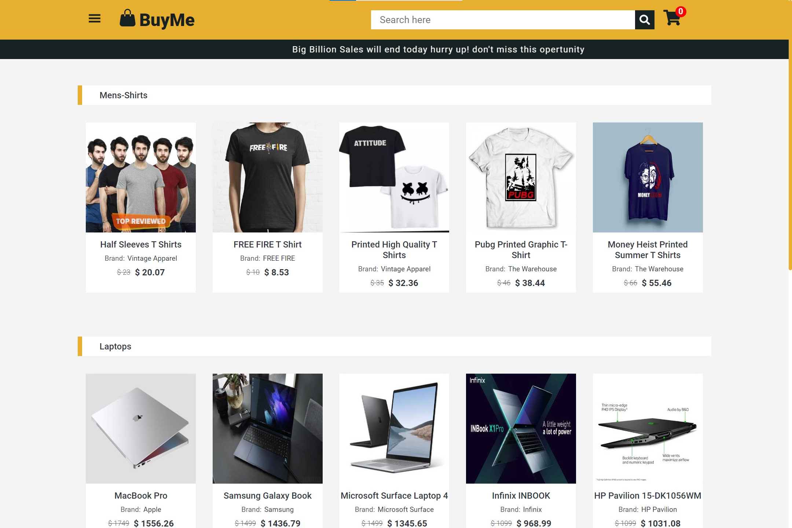
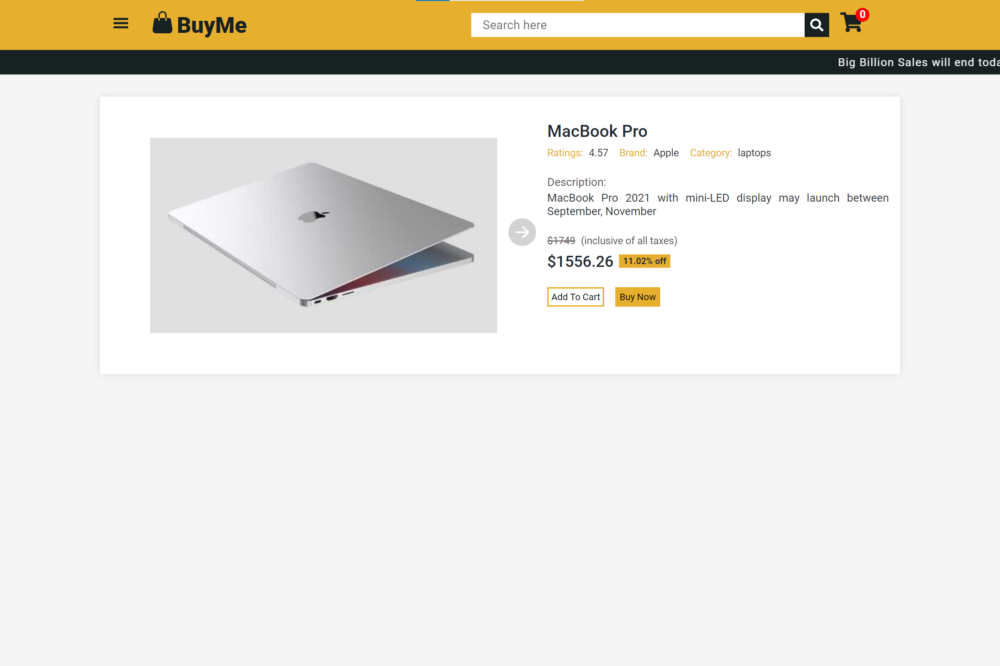
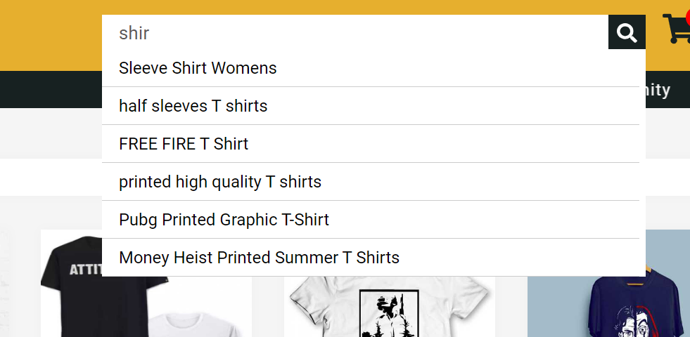
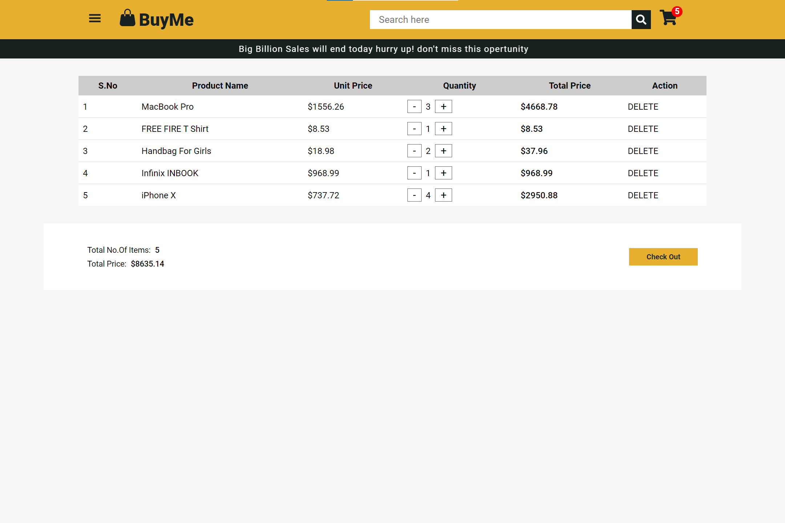
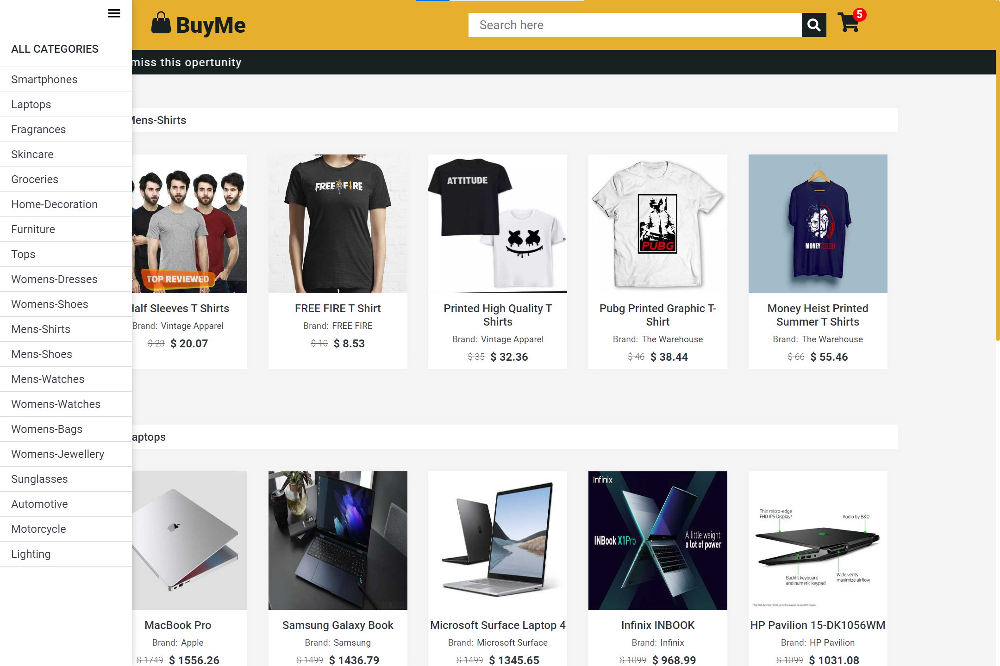

# BUY ME(e-commerce app)

<p align="center"></p>

This is an E-commerce web application. It is developed using `Dummy JSON API` and `redux-toolkit`. This application will fetch the data from the server and deliver it to the user. The user can search for specific products, view product details, add to a cart, and so on.

🚀[CLICK HERE](https://iammadhanmohan.github.io/buy-me/) to visit the site or copy the below link

🔗[https://iammadhanmohan.github.io/buy-me/](https://iammadhanmohan.github.io/buy-me/)

## 🔨Tools & Technologies


- HTML
- CSS
- React
- Redux-Toolkit
- React-Redux
- React Router
- Axios
- React-Icons
- GitHub-pages

## ⛳Features


- Responsive.
- Cart feature.
- Full details of a product.
- User can search for a product.
- Products filtered by category.
- User's Friendly.

## Installation steps


Want to try it in your local system? Then follow the below steps.

1. Download the project in zip format.
1. Unzip the file in your local system.
1. Open the folder in the VS code terminal or command prompt.
1. Download the dependencies by running the below command.

```
npm install
```

> Note: Make sure your local system has Node before running the above command.

5. After installing Dependencies run the below command to start the application.

```
npm start
```

## Screenshots


Some of the screenshots of this application are attached below.

<p align="center"></p>
<p align="center"></p>
<p align="center"></p>
<p align="center"></p>
<p align="center"></p>

## Thank you for checking


#### Give a 🌟Star if you like my project.

#### Comment📝 your issues or 🐞bug or any 👀suggestions in issue tab.
